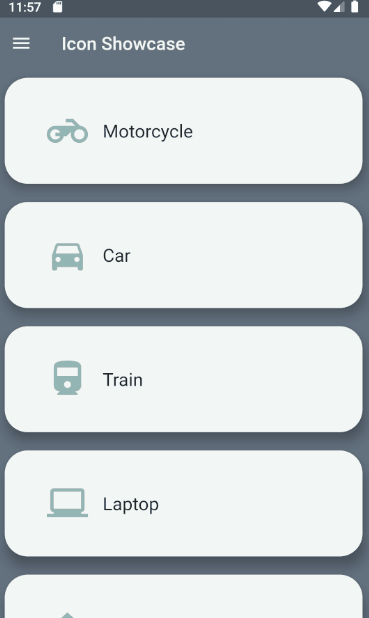

# icon_showcase_design_part

This Flutter Project Contain the first part of Icon Showcase App.
Read the tutorial at [Flutter | มาลองทำแอป Icon Showcase || Part I การดีไซน์](https://medium.com/@cheersupzoo/flutter-%E0%B8%A1%E0%B8%B2%E0%B8%A5%E0%B8%AD%E0%B8%87%E0%B8%97%E0%B8%B3%E0%B9%81%E0%B8%AD%E0%B8%9B-icon-showcase-part-i-%E0%B8%81%E0%B8%B2%E0%B8%A3%E0%B8%94%E0%B8%B5%E0%B9%84%E0%B8%8B%E0%B8%99%E0%B9%8C-6a41da6a39cc)

## Getting Started

### Installing
Clone the files and then run

`flutter pub get`

### Running the tests

`flutter run`
